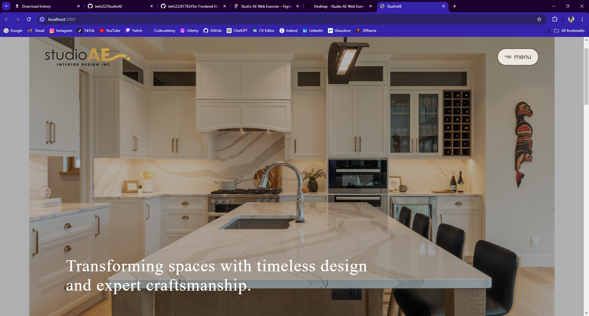

# Front End Developer Task

This project is a task for the Front End Developer role. It includes JavaScript, HTML, and SCSS for creating a layout based on a Figma design.

#

StudioAE

> Front End Developer Assessment Project - Array.

## Table of Contents

- [General Info](#general-information)
- [Technologies Used](#technologies-used)
- [Screenshots](#screenshots)
- [Demo Video](#demo-video)
- [Usage](#usage)
- [Project Status](#project-status)
- [Room for Improvement](#room-for-improvement)
- [Acknowledgements](#acknowledgements)
- [Contact](#contact)
<!-- * [License](#license) -->

## General Information

This webpage is developed to showcase knowledge of developing responsive and interactive webpages using plain HTML, SCSS, and JavaScript.

## Technologies Used

- HTML - version html5
- SCSS
- CSS
- SASS
- git version 2.38.1.windows.1
- github

## Screenshots

## Demo Video

## Usage

The app should have the following features:

- **Menu** - simple dropdown menu with sub-menu features
- **Content Feed** - parts of the body contain scrollable image sections with neat horizontal navigation features
- **Responsive Content** - Some of the buttons and images(and spaces containing them) are responsive to hover and offer different animations

## Project Status

Project is: Semi-Complete (Demo)

## Room for Improvement

- The website is not fully mobile-responsive. Unfortunately adding responsiveness takes more time and would make me miss the initial project deadline. The banner needs the most work with mobile-responsiveness.

- The menu needs more work, especially with the animations!

- Most of the buttons do not have animations as there is currently no page developed for where they would lead to. The entire button layout needs to be changed as well as I used image files for some of the buttons, and need to find their respective hover images. Some of the animations for hovering images were changed to save time.

- Some of the main image files are out of focus and need to be adjusted.

## Acknowledgements

- Many thanks to Array for including me in their Front End Developer assessment project.

## Contact

Created by Behbod Babai - feel free to contact me via email!
my email: behibabai@gmail.com
